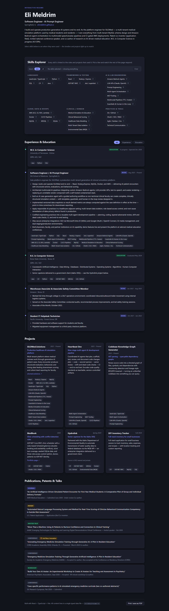
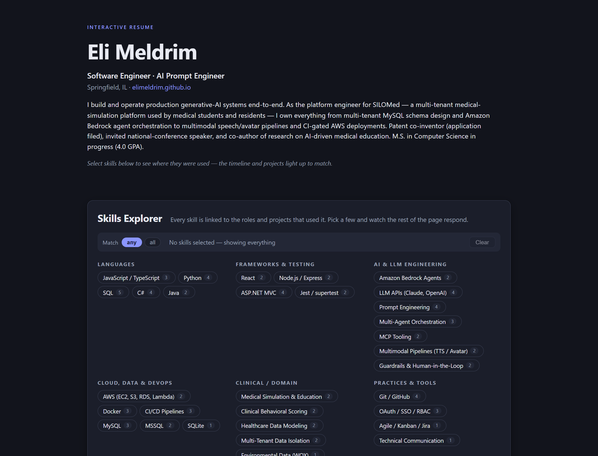

# Interactive Resume / Skills Explorer

A data-driven, explorable version of Eli Meldrim's resume, built with **React 18 + TypeScript + Vite**. Instead of a static PDF, the resume is a small interactive app: every skill is cross-linked to the roles, education, and projects that used it, so a reader can select the skills they care about and watch the rest of the page respond.

## Features

- **Hero header** — name, title, and a short professional summary.
- **Skills Explorer (the centerpiece)** — skills rendered as selectable tags, grouped by category (languages, frameworks, AI/LLM engineering, cloud/data, clinical/domain, practices). Selecting skills highlights matching timeline entries and projects and dims the rest. Supports *match any* / *match all* modes, live match counts, and one-click clear. Skill tags inside cards are clickable too, so you can pivot the filter from anywhere on the page.
- **Interactive timeline** — experience and education on a single vertical timeline, filterable by type (All / Experience / Education), sorted most-recent first.
- **Projects grid** — cards with taglines, descriptions, tags, and links.
- **Publications, patents & talks** — kind badges (journal, patent, invited talk, conference, workshop) plus award callouts.
- **Print-friendly** — an `@media print` stylesheet collapses the app into a clean, compact resume: interactive chrome disappears, chips become plain text, cards flatten to typographic sections. Use the "Print / save as PDF" button in the footer or `Ctrl+P`.
- **Light/dark themes** — automatic via `prefers-color-scheme`, using CSS custom properties.
- **Responsive** — grid and toolbar layouts adapt down to phone widths.

## Data-driven design

All content lives in **one typed file: [`src/data/resume.ts`](src/data/resume.ts)**. The React components contain zero resume content — they just render whatever is in the data file.

To edit the resume:

1. **Skills** — add or edit entries in `allSkills` (pick a `category` from `skillCategories`). Skill `id`s are string literals captured with `as const`, and the exported `SkillId` type is derived from them.
2. **Cross-links** — every timeline entry and project has a `skills: SkillId[]` array. Because `SkillId` is a literal union, **a typo'd or deleted skill id is a TypeScript compile error** — cross-links can never silently dangle.
3. **Timeline** — add entries to `timeline` with `type: 'work' | 'education'`, a display `period` string, and a numeric `sortKey` (`YYYYMM`) used for ordering.
4. **Projects / publications / hero** — plain arrays and objects; edit in place.

Run `npm run build` after editing — the TypeScript compile doubles as a data validation pass.

## Running it

```bash
npm install
npm run dev       # dev server at http://localhost:5173
npm run build     # type-check + production build into dist/
npm run preview   # serve the production build locally
```

## Screenshots





## Project structure

```
src/
  data/resume.ts          # ALL content — the only file to edit for updates
  App.tsx                 # selection state + match logic
  components/
    Hero.tsx
    SkillsExplorer.tsx    # grouped skill tags + toolbar (any/all, counts, clear)
    SkillChip.tsx         # shared clickable tag (explorer + cards)
    Timeline.tsx          # filterable experience/education timeline
    ProjectsGrid.tsx
    Publications.tsx
  styles.css              # themes (light/dark) + print stylesheet
```
